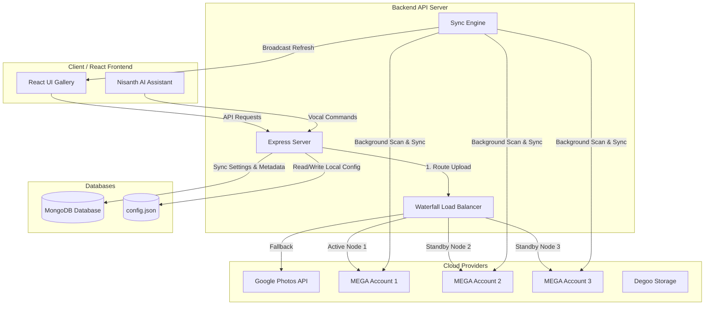

# 🔐 Nisanth Wallet – System Documentation: Multi-MEGA Cloud Connection & Sync Engine

This documentation details the architecture, configuration, security, and operation of the Multi-MEGA Cloud Connection, Auto-Sync, and Sandbox Isolation System integrated into the Nisanth Wallet platform.

---

## 🗺️ System Architecture

The system consolidates files from multiple cloud providers (Google Photos, Degoo, and up to three MEGA accounts) into a unified, lightweight React frontend gallery with zero local disk footprint on the server.



---

## 🛠️ 1. Multi-MEGA Cloud Connection Manager

Admin Gokul can connect up to three separate MEGA Cloud accounts directly from **Admin Panel** $\rightarrow$ **Cloud Wallets**.

### How Connections Are Stored
* **Config File (`backend/data/config.json`):** Configured accounts are registered as:
  * `mega1Enabled`, `mega1Email`, `mega1Password`
  * `mega2Enabled`, `mega2Email`, `mega2Password`
  * `mega3Enabled`, `mega3Email`, `mega3Password`
* **MongoDB Database (`CloudAccount` Collection):** On startup or update, values are synced to MongoDB documents with `provider: 'mega1' | 'mega2' | 'mega3'`.

### Operation
* **Connect:** Input email and password. Click "Deploy Integration".
* **Toggle Switch:** Turns uploader routes on or off instantly.
* **Disconnect:** Deletes credentials and disables the card route.
* **Online Pulsars:** Shows green glowing status dot when active connection is established.

---

## 🌊 2. Waterfall Load Balancing Algorithm

To prevent accounts from hitting capacity limits, uploads are automatically load-balanced across the active nodes.

### Logic Cycle (Waterfall Flow)

```
[File Upload Received]
       │
       ▼
Check MEGA 1: Enabled? Connected? Free Space > 20MB? ──► YES ──► Upload to MEGA 1
       │ No
       ▼
Check MEGA 2: Enabled? Connected? Free Space > 20MB? ──► YES ──► Upload to MEGA 2
       │ No
       ▼
Check MEGA 3: Enabled? Connected? Free Space > 20MB? ──► YES ──► Upload to MEGA 3
       │ No
       ▼
Fallback to MEGA 1 (or Google Photos/Degoo) & Log Warning
```

### Key Rules
* **20MB Buffer:** A safety buffer of 20MB is checked. If space falls below this, the card status changes to `Full (Bypassed)` and the cascade steps to the next standby card.
* **Uploader Route Tags:** The UI tells the admin which card is active (`Primary Node`), which card is on standby (`Waterfall Standby`), and which card is full (`Full (Bypassed)`).

---

## 🔑 3. Google Photos OAuth Configuration

To bridge Google Photos into the unified aggregator:

### Step 1: Client Credentials Input
Save your Google API keys into `config.json` or the admin config settings:
* `googleClientId`: `YOUR_CLIENT_ID`
* `googleClientSecret`: `YOUR_CLIENT_SECRET`

### Step 2: Obtain Authorization URL
On server boot, the system automatically prints the authorization link in the terminal:
```text
🔑 GOOGLE PHOTOS OAUTH LOGIN URL FOR ADMIN:
Open this URL: https://accounts.google.com/o/oauth2/v2/auth?client_id=YOUR_CLIENT_ID...
```

### Step 3: Login & Consent
1. Open the URL in a browser.
2. Sign in with the Google Account (`YOUR_GOOGLE_EMAIL`).
3. Allow permissions for Google Photos Library access.

### Step 4: Callback Exchange & Token Storage
1. Google redirects you to `http://localhost:5000/api/auth/google/callback?code=xxxxxx`.
2. The backend intercepts the code, exchanges it with Google OAuth Servers for an Access Token & Refresh Token, and saves them to `config.json` and MongoDB.

---

## 🔄 4. Background & Manual Sync Engine

Files uploaded directly in MEGA folders externally (outside the app) are dynamically synchronized back into the website gallery.

### Components
* **Background worker (`startBackgroundCloudSync()`):** Spins up on server boot. Periodically calls the sync engine every 5 minutes (`megaSyncInterval: 300000ms`).
* **Metadata Sync Engine (`syncService.js`):**
  1. Loops through enabled accounts (`mega1`, `mega2`, `mega3`).
  2. Connects to MEGA (with 3 connection retries in case of network spikes).
  3. Scans the `/BestiesMemoryWallet` root folder recursively (Photos, Videos, Documents).
  4. Resolves public stream/download URLs (with 3 link retrieval retries).
  5. Compares remote files against the local database:
     * **New File:** Seeds media details (name, size, type, URL, date) as a new `MediaItem`.
     * **Existing File:** Updates public stream links and appends the node key to the `activeClouds` array.
* **SSE Auto-Refresh:** On sync completion, the server sends a Server-Sent Event (type: `'refresh'`) to all active clients. The frontend gallery immediately catches the event and reloads lists automatically—no page refresh needed!

---

## 🔒 5. Strict Role-Based Sandbox Isolation

To guarantee that secondary members (Nivetha) remain isolated from technical details, a security sandbox is applied in the frontend:

| Component / Page | Owner Mode (Gokul) | Secondary Mode (Nivetha) |
| :--- | :--- | :--- |
| **Dashboard / Sidebars** | Full access to "Cloud Wallets" configurations. | Cloud config tabs and page routes are locked with access-restricted indicators. |
| **Terminologies** | "Unified Cloud Storage Aggregator", "Upload to Cloud", "MEGA Cloud 1/2/3" | "Vault Secured Media Aggregator", "Upload to Vault", "Secure Vault 1/2/3" |
| **Cloud badges on media cards** | Shows logo identifiers (Google Photos, Mega 1/2/3, Degoo) | Shows generic vault tags (Vault 1, Vault 2, Vault 3) |
| **API Health Status Checks** | Visible green/yellow/red status indicators. | Hides status pulsars and credentials data. |
| **AI Assistant Controls** | Voice navigation commands allow database syncing. | Assistant ignores instructions about "cloud wallet" or "backend hosts" with a standard conversational prompt blocking list. |

---

## 🛠️ 6. File & Database Schema Reference

### MediaItem Database Schema (`backend/models/MediaItem.js`)

```javascript
const MediaItemSchema = new mongoose.Schema({
  filename: { type: String, required: true, unique: true },
  originalName: { type: String, required: true },
  type: { type: String, enum: ['photo', 'video', 'document'], required: true },
  category: { type: String, default: 'Photos' },
  size: { type: Number, required: true },
  uploadDate: { type: Date, default: Date.now },
  uploadedBy: { type: String, required: true },
  urls: {
    google: { type: String, default: '' },
    mega: { type: String, default: '' }, // Legacy
    mega1: { type: String, default: '' },
    mega2: { type: String, default: '' },
    mega3: { type: String, default: '' },
    degoo: { type: String, default: '' }
  },
  activeClouds: [{ type: String, enum: ['google', 'mega', 'mega1', 'mega2', 'mega3', 'degoo'] }],
  tags: [{ type: String }]
});
```

---

## ❓ 7. Troubleshooting Guide

### 🔴 "MEGA Auth Error: Connection Timeout"
* **Cause:** Network spikes blocking communication with MEGA servers, or incorrect login credentials.
* **Fix:** Check `config.json` to verify the email and password are correct. The system will retry 3 times automatically. If it still fails, it operates in simulated mode.

### 🔴 "Google Photos API returned HTTP 401 Unauthorized"
* **Cause:** Google Photos API Access Token has expired (Access tokens expire every 60 minutes).
* **Fix:** Open the Google login link printed in your terminal again to refresh authorization, or click "Change Account" inside the Cloud Wallet settings tab to bind the new token.

### 🟡 Gallery is empty or slow to synchronize
* **Cause:** The background scheduler runs every 5 minutes.
* **Fix:** Go to **Admin Panel** $\rightarrow$ **Cloud Wallets**, select the **Cloud Wallets** tab, and click the **Sync Vaults** button at the top. This immediately calls the `POST /api/admin/sync` route to index all media instantly.
