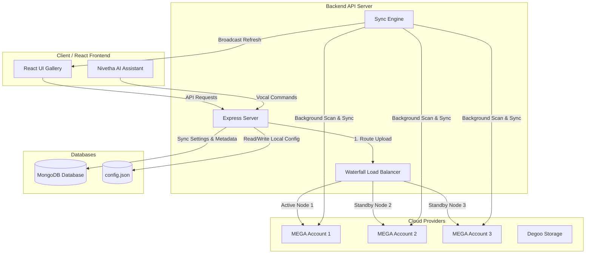

# 🔐 Nisanth Besties – System Documentation: Brand-New Secure OTP & Sync Engine

This documentation details the architecture, authentication flow, security configuration, and operation of the **Nisanth Besties** memory sharing platform.

---

## 🗺️ System Architecture

The platform aggregates memories (Photos, Videos, Timeline stories) into a unified, secure React gallery that runs in tandem with an Express API backend.



---

## 🔑 1. Brand-New Secure Login System

The platform enforces strict authentication using a winking-eye glassmorphism login portal. No signup or public registration is available.

### Predefined User Access Rules
Only two predefined users are authorized to access the system:
* **Gokul** (Role: `owner` / Admin)
  * Email: `prasanthgokul736@gmail.com`
  * Mobile: `7094610210`
  * Password: `Gokul@709`
* **Nivetha** (Role: `secondary` / User)
  * Email: `nivethanivetha2109@gmail.com`
  * Mobile: `6380431813`
  * Password: `Nivetha@2109`

---

## 📧 2. SMTP OTP Delivery Flow

To protect private data, a two-step authentication system sends email verification codes dynamically using a secure Gmail integration.

### Login & OTP Verification Cycle
1. **Credentials Input:** The user enters their Email OR Mobile Number along with their Password in the centered glassmorphism login form.
2. **Phase 1 Validation:** The server validates the credentials.
   * If correct, it generates a secure **6-digit OTP** valid for **5 minutes**.
   * The server delivers this OTP code via SMTP email only (no OTP is sent to the mobile number).
   * It returns a signed temporary JWT token (`tempToken`) containing the hashed OTP.
3. **Phase 2 Verification:** The user inputs the 6-digit OTP code.
   * The server decodes `tempToken`, verifies the OTP against the signed hash, and grants a secure 7-day session token if successful.

### SMTP App Credentials
The mailer utilizes the following configuration:
* `SMTP_HOST`: `smtp.gmail.com`
* `SMTP_PORT`: `587`
* `SMTP_USER`: `nisanthbsts143@gmail.com`
* `SMTP_PASS`: `tnqv jkaa vrxi nhje` (Gmail App Password)

---

## 🌊 3. Waterfall Load Balancing Algorithm

To prevent cloud account saturation, uploads are load-balanced dynamically across active storage nodes:

```
[File Upload Received]
       │
       ▼
Check MEGA 1: Enabled? Connected? Free Space > 20MB? ──► YES ──► Upload to MEGA 1
       │ No
       ▼
Check MEGA 2: Enabled? Connected? Free Space > 20MB? ──► YES ──► Upload to MEGA 2
       │ No
       ▼
Check MEGA 3: Enabled? Connected? Free Space > 20MB? ──► YES ──► Upload to MEGA 3
       │ No
       ▼
Fallback to MEGA 1 (or Degoo) & Log Warning
```

---

## 🔒 4. Strict Role-Based Sandbox Isolation

Secondary users are isolated from storage parameters and cloud keys.

| Component / Page | Owner Mode (Gokul) | Secondary Mode (Nivetha) |
| :--- | :--- | :--- |
| **Dashboard / Sidebars** | Full access to "Cloud Wallets" configurations. | Cloud config tabs and page routes are locked with access-restricted indicators. |
| **Terminologies** | "Unified Cloud Storage Aggregator", "Upload to Cloud" | "Vault Secured Media Aggregator", "Upload to Vault" |
| **Cloud badges on media cards** | Shows logo identifiers (Mega 1/2/3, Degoo) | Shows generic vault tags (Vault 1, Vault 2, Vault 3) |
| **AI Assistant Controls** | Voice navigation commands allow database syncing. | Assistant blocks requests about cloud secrets or system configs. |

---

## 🛠️ 5. Troubleshooting Guide

### 🔴 "SMTP Error: Bad Credentials"
* **Cause:** Gmail App Password changed, or credentials entered incorrectly in `.env`.
* **Fix:** Update `SMTP_USER` and `SMTP_PASS` in the `.env` file and restart the backend.

### 🔴 "Verification session expired"
* **Cause:** The 6-digit OTP was entered after the 5-minute timeout window.
* **Fix:** Click "Resend OTP" or "Back" to restart the login process.
